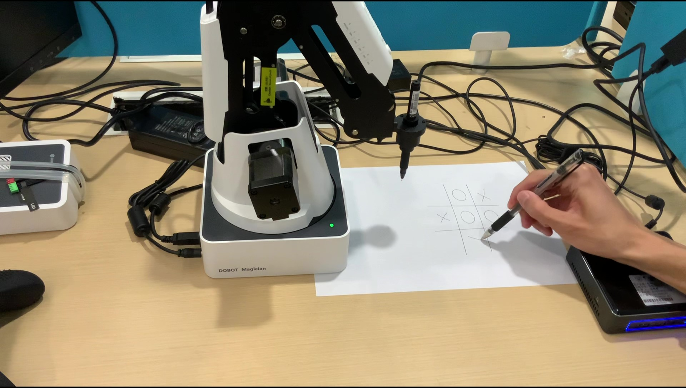

# doodbot: 基于计算机视觉的机械臂下棋控制系统
> 这是junkdood的毕业设计机械臂，借助一个Xbox Kinect体感摄像机实现了自主的人机下棋对弈系统

简单功能演示视频如下~

<a href="docs/record/assets/miniplay.mp4" title="演示视频"></a>

---

### 1.项目文件说明 

本项目是一个ROS package，其文件夹结构如下：

- src

  这里存放了项目源代码

- include
  
  存放c++的头文件之类的地方

- launch

  这里有一些方便的ROS launch启动脚本

- msg

  自己定义的ROS话题数据类型放这里

- srv

  自己定义的ROS服务数据类型放这里

- CNNdata

  用于存放相机感知模块的卷积神经网络用到的数据和生成的识别模型

- MPCdata

  里面的表格记录了机械臂运动的轨迹，可以用来分析模型预测控制算法的效果

- docs

  有用的文档、写的记录存放的地方


### 编译
假设已经有ros环境和casadi环境（casadi下面有安装步骤）
```sh
mkdir -p ~/catkin_ws/src && cd ~/catkin_ws/src
git clone https://github.com/junkdood/doodbot.git
cd ..
catkin_make
```

### 运行
运行先需要source一下环境
```sh
cd ~/catkin_ws
source devel/setup.bash
```

归零
```sh
roslaunch doodbot sethome.launch
```

直接键盘控制
```sh
roslaunch doodbot jog.launch
```

跑模型预测控制
```sh
roslaunch doodbot hardware_test.launch
```

跑相机图像处理程序
```sh
rosrun doodbot imager.py
```

训练OX识别
跑相机图像处理程序(数据集已经被我删了)
```sh
rosrun doodbot pretrain.py
```

读取手柄消息并发布
```sh
rosrun doodbot gamepad.py
```

跑MPC实验
```sh
rosrun doodbot exp_node
rosrun doodbot lat.py
```

运行rosbag模拟相机驱动输出
```sh
rosbag play -l rosbag/camera.bag
```

### Xbox控制指南

| key | move |
| :---: | :----: |
|左摇杆|前后左右|
|左右扳机|上升/下降|

### 键盘控制按键指南

| key | move |
| :---: | :----: |
|w|forward|
|a|left|
|s|backward|
|d|right|
|u|up|
|i|down|
|j|hand counterclockwise|
|k|hand clockwise|
|others|stop|


### some ros command

```sh
rqt_graph
rosbag
rosrun tf view_frames
rosrun tf tf_echo
rviz
```

### problem solved

1. `rosrun dobot DobotServer ttyUSB0` -> `Invalid port name or Dobot is occupied by other application!`
   The problem happens when “ttyUSB0” doesn’t have authority.
   Just give an authority to “ttyUSB0”.
   ```sh
   sudo chmod a+rw /dev/ttyUSB0
   ```
   or just run as
   ```sh
   rosrun doodbot DobotServer /dev/tty
   ```

2. 因为机械臂关机之后关节不会锁定，重新开机后会有极大的误差，一定要跑归零


3. 安装 c++ 的 casadi
   ```sh
   sudo apt-get install coinor-libipopt-dev
   sudo apt install gfortran
   sudo apt install swig
   git clone https://github.com/casadi/casadi.git -b master casadi 
   cd casadi
   mkdir build
   cd build
   cmake -DWITH_PYTHON=ON -DWITH_IPOPT=true ..
   make
   sudo make install
   ```

4. 安装 kinect 驱动
   [libfreenect2](https://github.com/OpenKinect/libfreenect2)

5. 安装 kinect2_bridge
   ```sh
   cd ~/catkin_ws/src/
   git clone https://github.com/code-iai/iai_kinect2.git
   cd iai_kinect2
   rosdep install -r --from-paths . --ignore-src
   cd ../..
   catkin_make -DCMAKE_BUILD_TYPE="Release"
   ```

6. Xbox 手柄驱动
   [xpadneo](https://github.com/atar-axis/xpadneo)

7. to be continue