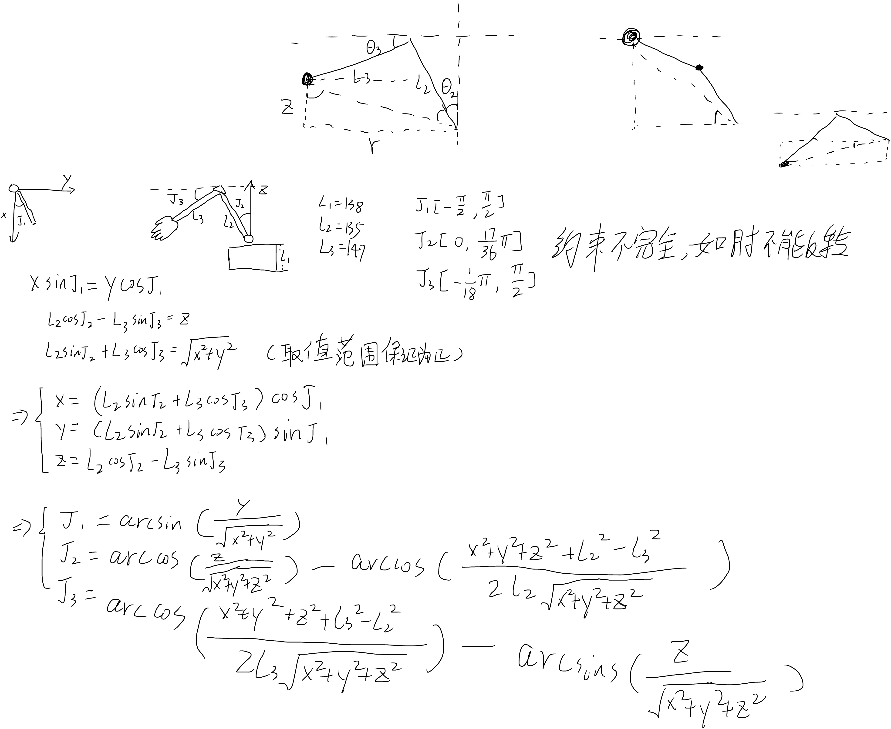
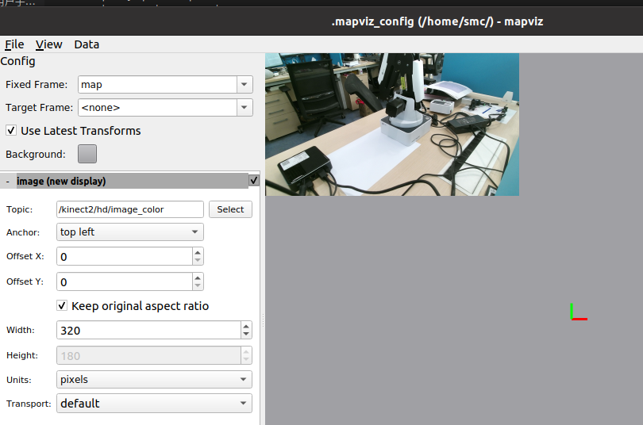
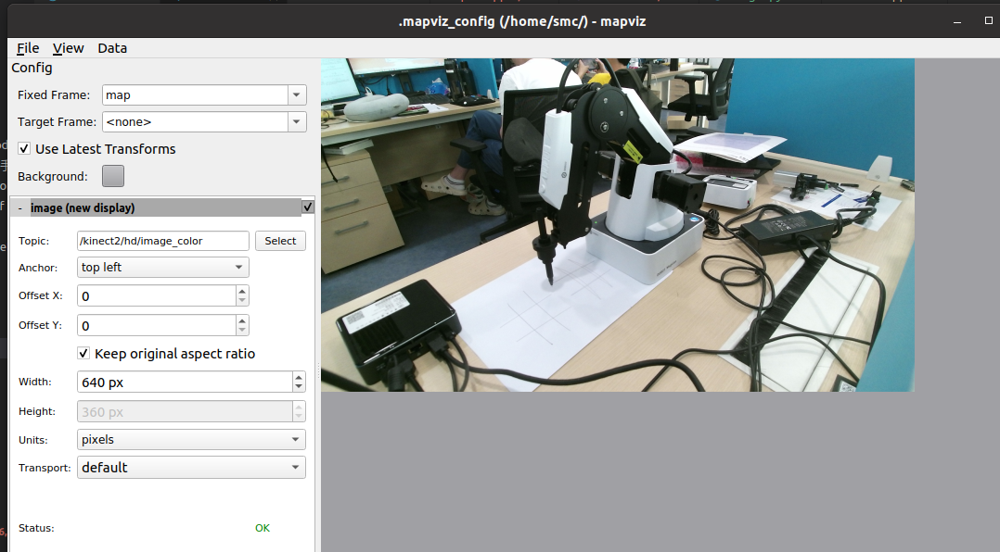
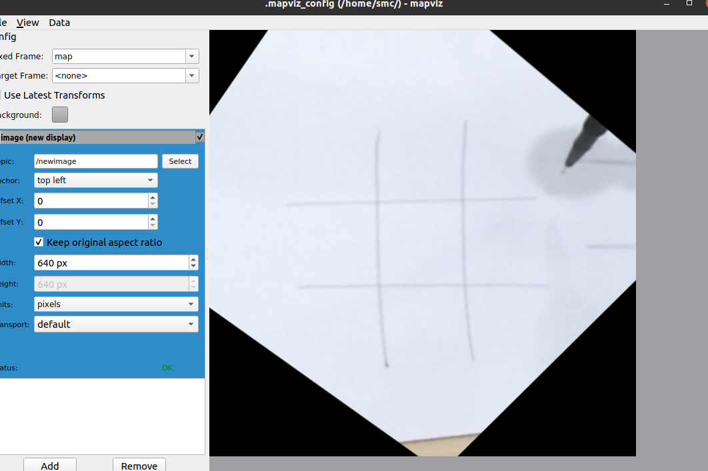
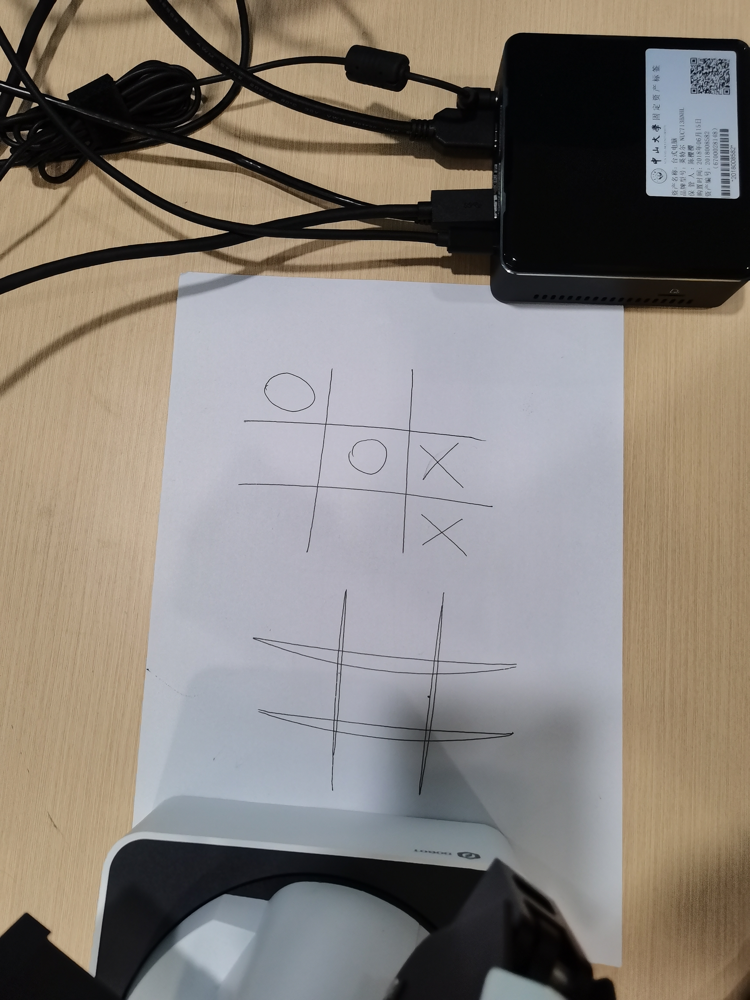
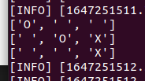
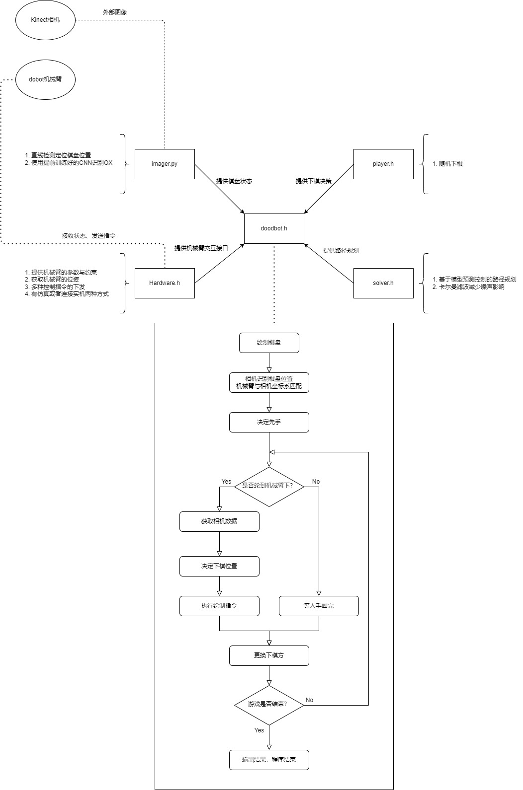

### 记录

#### 2022-1-1
找到了靠谱的底层控制方式
dobot magician 提供了点到点的控制方式和直接控制关节转动的方式。鉴于点到点的控制方式应该是内嵌了类似PID的算法，封装程度较高，为了能体现个人控制算法的精度效果暂时先用直接控制关节转动的方式。

直接控制关节转动需要如下步骤：预设速度与角速度，然后直接发送转动命令，再发送停止命令实现一段位移。因此，需要自己预估时间。一开始为使用的是 ros::Duration 。但命令发送有较大的时延波动，按照速度乘时间来算位移会有几度的误差，无法接受。因此，采取的第二个方案是利用机械臂自带的人物队列功能，在转动命令和停止命令之间插入一条等待命令，再统一执行。这样，误差降低并稳定到+0.2度左右。这个数值是在固定参数下观测到的，仍须更多数据支撑，不过已经比 ros::Duration 好了。初步判断是机械臂任务队列指令切换延迟导致的。可以考虑借用论文方法消除误差。

下一任务：使用 casadi 求解库实现简单点到点规划。ROS 的 MoveIt! 插件是专门针对机械臂规划的，但是好像封装程度还是太高，暂时不用。


#### 2022-1-2
几何求解了该机械臂的运动学方程和对应逆解

直接用余弦定理求解x，y，z坐标与机械臂关节的关系，公式如下。需要注意机械臂关节角度能取到什么范围，好区分角度大于小于0的情况。



对应伪代码
```c++
void xyz_to_jointAngle(float x, float y, float z, float jointAngle[4]){
    double r_2 = x*x + y*y;
    double d_2 = r_2 + z*z;
    double d = sqrt(d_2);
    jointAngle[0]=asin(y/sqrt(r_2));
    jointAngle[1]=acos(z/d) - acos((d_2 + _l1_2 - _l2_2)/(2*_l1*d));
    jointAngle[2]=acos((d_2 + _l2_2 - _l1_2)/(2*_l2*d)) - asin(z/d);
    return;
}

void jointAngle_to_xyz(float jointAngle[4], float &x, float &y, float &z){
    double r = _l1*sin(j1) + _l2*cos(j2);
    x = r*cos(j0);
    y = r*sin(j0);
    z = _l1*cos(j1) - _l2*sin(j2);
    return;
}
```
测试了许多姿态下都能正确计算，暂时没有发现bug

下一任务：使用 casadi 求解库实现简单点到点规划。

#### 2022-1-3
安装casadi，还在考虑用c写还是python
决定再重读一下论文在继续写

下一任务：使用 casadi 求解库实现简单点到点规划。

#### 2022-1-7
开始写求解器的类

发现构建的运动学模型几乎是线性的，根本不需要用上复杂的用于求解非线性规划(nlp)的微分方程求解器。
不过先实现一个杀鸡用牛刀的版本吧。

下一任务：继续实现。


#### 2022-1-8
用casadi写SystemDynamics的时候感觉用JOG接口定义的方式相当奇怪，想调用dll里面的sendpluse直接控制步进电机
但是官方文档没写接口用法，打算发邮件问一下。


#### 2022-1-10
继续完成一部分solver 类

问到了sendpluse需要的特殊开发固件，但是由于该固件功能很少，每次sendpluse之后姿态信息不会自动更新；而且对于关节2与关节3的角度读取有问题。用这个好像不太行。
之前的想法是利用sendpluse，在dt内传入k个脉冲，相当于有了速度，所以就可以列出微分方程。


想找办法同时控制多个电机，不然状态转移太难写了

#### 2022-1-11

不如只输出路径，控制用PTP

求解器已基本实现，差状态方程。求导太难了

#### 2022-1-12
状态方程写完了，写法比较暴力，肯定还有优化空间。
先当作是对的好了

现在机械臂的运动需求就可以公式化了，costfuntion可以是控制量不能太大以免速度过高，也可以是xyz轴尽量靠近目标以降低抖动。

简单验证了一下写的状态方程应该没问题


#### 2022-1-13
在实机上面验证了公式的正确性(除了机械臂运动极限的约束)

当前封装了两个类，第一个是与机械臂交互的Hardware_Interface，另外一个是基于casadi nlp求解器实现的直接配点法模型预测控制DirectCollocationSolver。

从Hardware_Interface的Get_Pose获取xyz坐标信息，给DirectCollocationSolver传开始点与结束点的xyz，它就能输出每个关节的控制序列，即每个时刻关节的转动速度。在把这个控制量传给Hardware_Interface的Send_Ctrl_Cmd，就能完成控制。

下面是实验数据。机械臂的初始位置是：
```sh
[ INFO] [1642069885.033557308]: 
x:74.939621
y:-0.000008
z:0.007721
```
第一次是让他沿x轴走五毫米，控制后位置是：
```sh
[ INFO] [1642069891.989512004]: 
x:79.939682
y:-0.000008
z:0.007721
```

第二次是让他沿y轴走五毫米，控制后位置是：
```sh
[ INFO] [1642069898.724678518]: 
x:79.939621
y:4.999989
z:0.007675
```

可见系统目前是可靠的，误差控制什么的就要去看论文了


#### 2022-1-21

写了一个简单的模拟器方便测试其他模块。

定义了相机模块输出的接口，模拟了相机的输出。相机模块要输出的数据是棋盘和棋子的位置原生数据，因为位置误差是需要规划的。


#### 2022-2-23

加了一个下棋的类的demo，大致作用是抽象出棋盘状态，并决定下哪里，最后输出具体位置。没实现完。

#### 2022-2-28

给SystemDynamics加上滤波器修正
滤波器demo，还没实现

#### 2022-3-1

发呆终于想明白了卡尔曼滤波器的 A B H 究竟要怎么写...
一直没想懂x状态空间和u控制空间怎么能同量纲放到一起
x应该是关节角度（论文的符号）
扩展KF好难写，想用库了..

另外GP嵌入到mpc内好像有点太复杂了

#### 2022-3-2

扩展KF写完，x又可以换回xyz坐标了

并验证了可运行性

#### 2022-3-3

验证扩展KF有效性。在有噪声的情况下，输出当前状态与上一个状态的差值，有KF的时候明显比较平滑，dx较小。（机械臂本来是在移动的，所以dx不会为0)

```sh
[ INFO] [1646278438.530534919]: 
dx:4.020370
dy:-0.655806
dz:1.875798

[ INFO] [1646278438.530561363]: 
KFdx:0.802849
KFdy:-0.122439
KFdz:0.199261
```
```sh
[ INFO] [1646278438.701524554]: 
dx:1.854515
dy:2.482308
dz:-0.009603

[ INFO] [1646278438.701552120]: 
KFdx:1.074982
KFdy:0.586471
KFdz:0.139695
```
```sh
[ INFO] [1646278438.872765506]: 
dx:-1.065063
dy:-3.780932
dz:0.811971

[ INFO] [1646278438.872797081]: 
KFdx:0.480878
KFdy:-0.604663
KFdz:0.320252
```

可以考虑加方差自适应？

#### 2022-3-4

方差自适应实现，至少协方差矩阵会趋于稳定

#### 2022-3-6

重写了硬件接口类，让模拟器和驱动同时继承一个接口模板
同时让代码里面处理角度的地方都是弧度制
状态空间加入了 r

模型预测控制与卡尔曼滤波融合

#### 2022-3-12

相机接入ros



利用rosbag记录了相机驱动输出，可以回放模拟


#### 2022-3-13

vis.cpp 被废弃，用imager.py处理图像

突然发现rosbag记录了师兄摸鱼




实现霍夫变换自动识别点，然后投影变换



#### 2022-3-14

相机识别模型初步实现
利用CNN识别字母，区分X和O
识别内容



识别结果



#### 2022-3-15

重构imager的代码
使用std_msgs.msg 的 Int32MultiArray 传递井字棋状态

把项目名从dobot改成doodbot

创建了doodbot类进行模块整合，管理回调函数啥的。plan.cpp弃用，改成test.cpp。

发现一个大问题，imager好慢...


#### 2022-3-16

imager的CNN真的很慢，识别一个块0.1秒。9个块就1秒了

简单写了一下画O和X的路径规划，基本能用。给solver加了一些奇奇怪怪的损失函数

#### 2022-3-17

完整下棋逻辑闭环基本完成



#### 2022-3-18

增加手柄控制支持，还未适配夹子
因为夹子转动的指令好像跟不上控制器速率

#### 2022-3-28

写了几天论文

增加了MPC采集数据的代码

CNN特制了一下之后准确率0.9995


#### 2022-3-29

调好环境跑了一遍完整的，录了一次像

迷你版：

<video src='assets/minipaly.mp4' width=180/>


